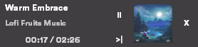

# Spotify Overlay  
This overlay allows you to check which music you are playing, skip, pause/resume it. This works over a fullscreen windowed app.


<br/>

## About

I have been looking for something like this ever since I got Spotify, I was tired of alt+tab during video games.

## Requirements
 - Python (tested on 3.9 and 3.10)
 - Spotify Premium Account & Spotify Developer Account

## Features
1. Updates text every second. So, the timer is perfect.
2. It uses ~20MB of ram + Python execution (~400MB).
3. Grabs images from Spotify and only updates them when the song name is different.
4. Automatically hides when spotify is stopped.
5. On top of windowed full screen apps.
6. Uses color theme of Spotify.
7. Skip button.
8. Pause/resume button.
9. You can configure colors, fonts, position and transparency of the window in `config.ini`
   
## Installation  
1. Run the following command to clone this repository.
`git clone https://github.com/guillaumederybel/SpotifyOverlay.git`
2. Go inside our directory and install requirements.  
   1. `cd SpotifyOverlay`
   2. `pip install -r requirements.txt` or `pip3 install -r requirements.txt` depending on platform.
   3. I recommended to install `CircularStd-Black.otf` font because it's almost the same as Spotify. You have to double click on it and then click install.


3. Now, you have to get your Client ID and Client Secret from Spotify's Developers' Dashboard. For that, follow the below steps-
      1. Go to https://developer.spotify.com/ and register an application.   
      2. Copy the Client ID and Client Secret. (Do not share the Client Secret) Put them inside `config.ini` file and you can also make other changes as per your preferences.
      3. Go to your application's settings on https://developer.spotify.com/dashboard
      4. Scroll down and look for Redirect URIs  and type http://localhost:8080/  and click on Add button.
      5. After adding above URI there, Scroll Down and click on SAVE button.
4. *Hooray!!* You have finally completed all the important configuration stuff. Now, you can run your app with Python using following command `python3 main.py`

## Automation at startup

On Windows, you can create a new Task to start the program when you logon.
I recommand to use PythonW instead of Python, else you will get a terminal window popping. Here's a PowerShell Script you can use :
```
$action = New-ScheduledTaskAction -Execute <Your PythonW location> -Argument <The main.py location> -WorkingDirectory <The directory of the project>
$trigger = New-ScheduledTaskTrigger -AtLogon
$task = New-ScheduledTask -Action $action -Trigger $trigger
Register-ScheduledTask "Execute Spotify Overlay" -InputObject $task
```

To know your PythonW location you can use the command "where pythonw" in a cmd (not PowerShell).